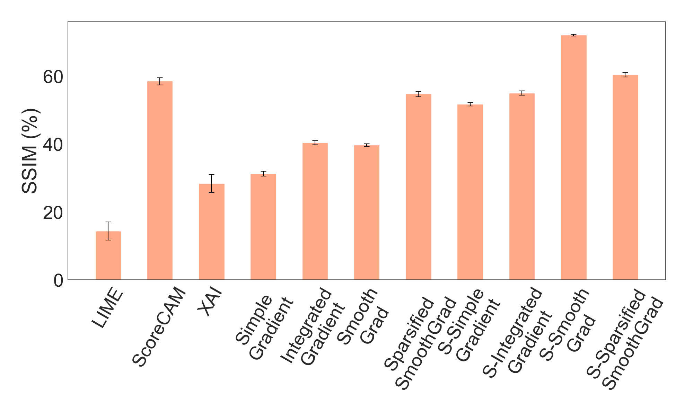
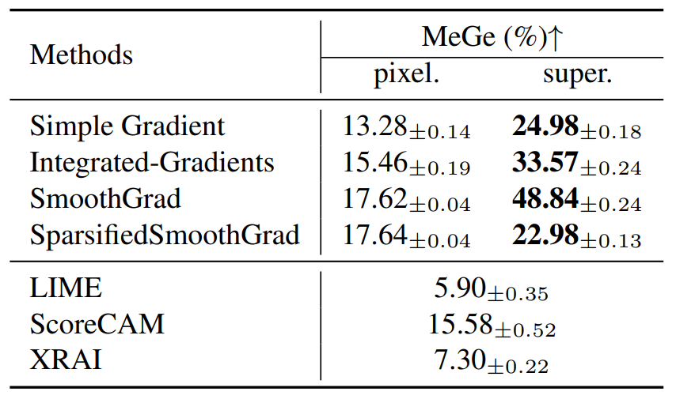
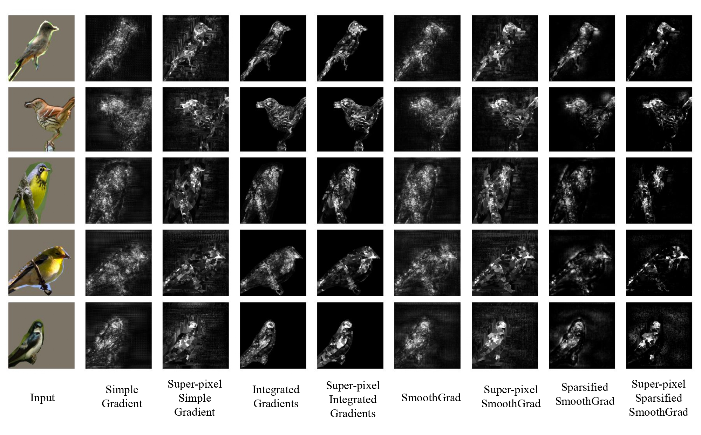
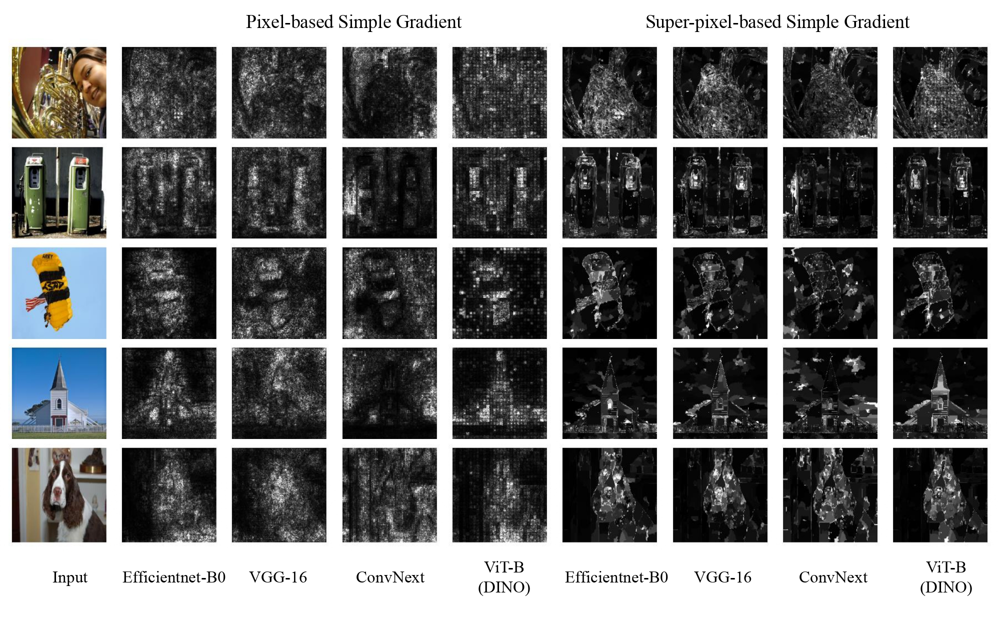
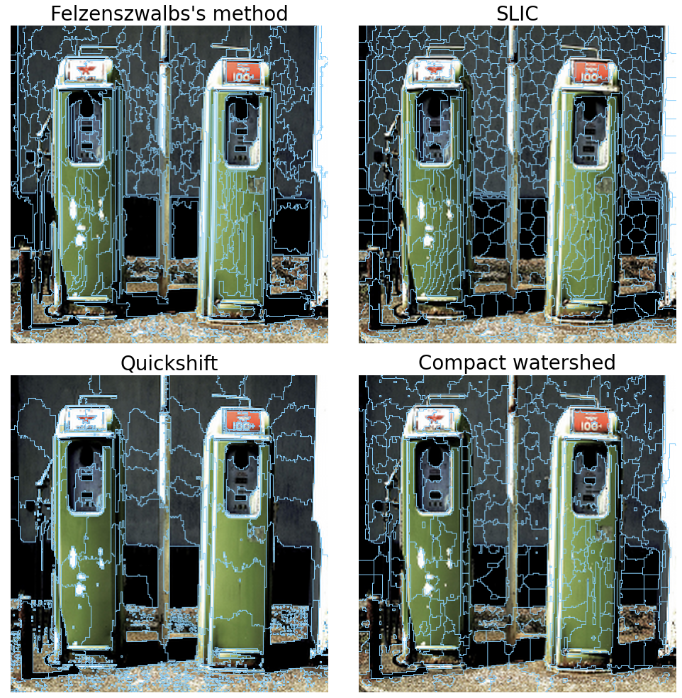
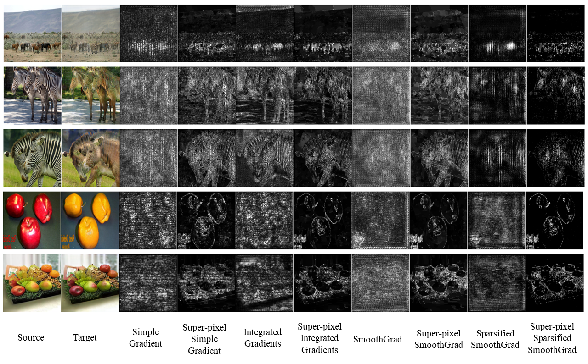
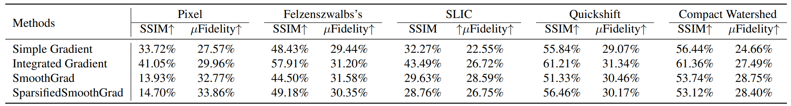
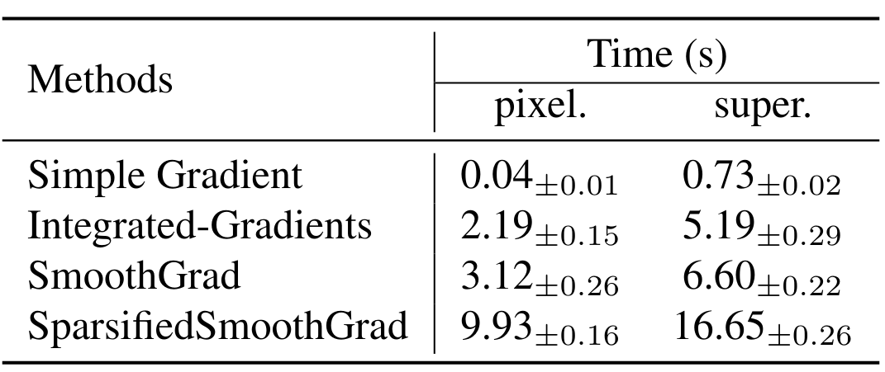

# A Super-pixel-based Approach to the Stable Interpretation of Neural Networks

 <em width="800"> Figure 1. The SSIM of saliency map between two models trained with
disjoint training datasets from CIFAR10 (with error bar). Super-pixel-based methods are started with "S-" for short.</em>

 <em> Table 1.  Comparison of MeGe between pixel-based and super-pixel-based methods. L2-norm is used as the distance measure.</em>

 <em width="800"> Figure 2.  Qualitative comparison on CUB dataset between pixel-based and super-pixel-based interpretation maps for
different methods.  Birds segmentations are used to mask out the background during the training and inference to manually remove the noise in saliency maps. Super-pixel-based methods can be more focused on specific body parts of the birds.</em>

 <em width="800"> Figure 3. Qualitative comparison on ImageNet dataset between pixel-based and super-pixel-based interpretation maps for
different network architectures with simple gradient. Super-pixel-based methods can achieve better visual quality and inter-architrcture consistency.</em>

 <em width="800"> Figure 4. Illustration of super-pixel-based partitions using different algorithms.</em>

 <em> Figure 5. Visualization of saliency maps for explaning the discriminator in CycleGAN. We conducted apple2orange and horse2zebra image translation tasks.</em>

 <em> Table 2. Comparison of stability and fidelity tradeoff among different super-pixel generation algorithms.</em>

 <em> Table 3. Computation time of different methods for processing one 224x224 images.</em>

